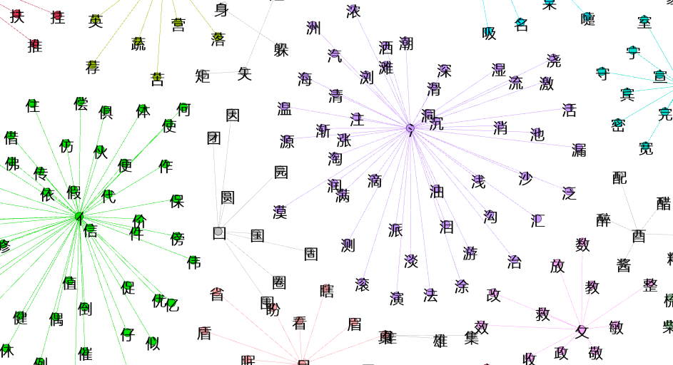

# HSK5 Word Graph

Common radicals for words to learn for HSK5.

hsk5_rad_graph.py is a simple python script that builds a pseudo adjacency list suitable to be imported by Gephi: I know it's not perfect but well...It gives the general idea.

The word list (ordered by frequency) has been taken from http://www.hskhsk.com/word-lists.html
The dictionary with radicals has been taken from https://raw.githubusercontent.com/skishore/makemeahanzi/master/dictionary.txt

Here it is a "full resolution" svg image of the whole HSK5 words sharing radicals:

The navigable graph is available at:
https://antigones.bitbucket.io/projects/hsk5_graph/#hsk5_rad.gexf

This project has been deeply inspired by the work done in [http://www.hskhsk.com/graphs.html](http://www.hskhsk.com).

